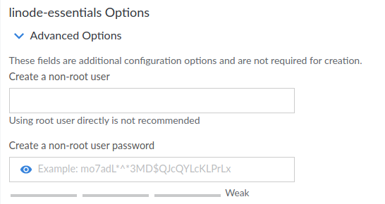
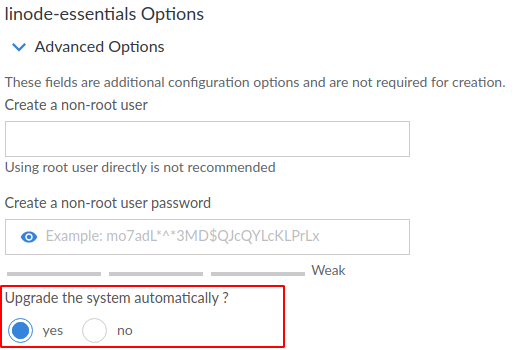
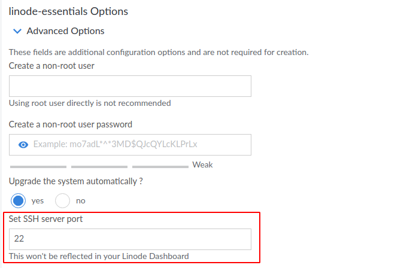
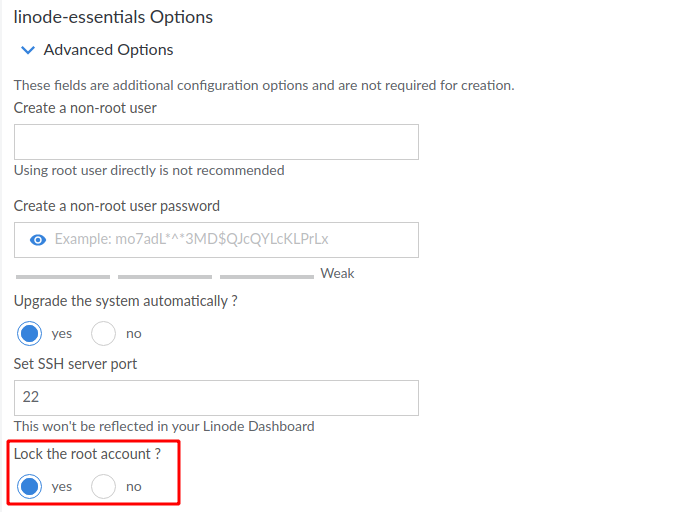

This repository contains various scripts (StackScripts) that are used to make Linode deployments much easier, dynamic and secure. There will be multiple scripts, intended for different purposes. Each script is going to be under the appropriate subdirectory and can be found directly from your Linode Dashboard under "Community StackScripts".

# 1. deploy-essentials

This script doesn't do much. It is currently tested under Ubuntu 20.04 LTS but *should* work with other Ubuntu flavours as well. The list of things that this script does are as follows

## A non-root user

Using the `root` user always in a production environment isn't the best idea. But Linode doesn't have the option to create a non-root user while deploying a server. This script takes care of that. 

The user creation is optional because there are times when a small test needs to be performed, and it's easier to use the `root` user for the time being. If no password is provided, the `root` is reused.

## Upgrade the system

This is again an optional setting, but defaults to yes. 

## SSH configuration

First it asks for a port number for the SSH daemon to run, defaults to port 22. I recommend setting it to something different and do remember that as ***this change won't be reflected on you dashboard***.

Based on other information, the script configures other parts of SSH as well. For example if you add a user, `root` won't be accessible through SSH, if at least one public key is provided, password log in is disabled.

## Locks the root user

You can also lock the `root` user right from the deployment screen.

## TODO

- [] Make the script compatible with all flavours of Alpine, Debian, Arch, OpenSUSE, Fedora.
- [] Optionally add automatic upgrades for certain distributions.
- [] Make the scripts Linode independent.
